

## Experiments:

Ground Truth: For convolution data set, there is a ground truth. For MRF, we assume ground truth will be the solution of the **primal problem** using CVX

Algorithms:

* Ours: Projected Gradient Descent on Dual Problem
* CVX: directly solving the primal problem
* TFOCS: directly solving the primal problem
* Interior-point: package by S.-J. Kim, K. Koh, M. Lustig, S. Boyd, and D. Gorinevsky
* Coordinate descent: glmnet

Parameter Setting:

|          Parameter          |     Experiment 1     |     Experiment 2   |
|:---------------------------:|:--------------------:|:------------------:|
|           Data Set          |     Conv Generated   |   Conv Generated   |    
|        Data Set Size        |          5000        |       5000         |
|    Nonegative Constraint    |         **No**       |      **YES**       |
|        Initialization       |           0          |         0          |
|      Line Search gamma      |          0.1         |        0.1         |
|          Tolerance          |         1e-8         |        1e-8        |
|        Max Iteration        |         5000         |        5000        |
| Line Search First Step Size |           1          |          1         |
|       Projection Mode       | Euclidean Projection |Euclidean Projection|
|  Recover Signal Windowsize  |           50         |          50        | 
|         Error Near 1        |         0.99         |         0.99       |

### Experiment 1 Results

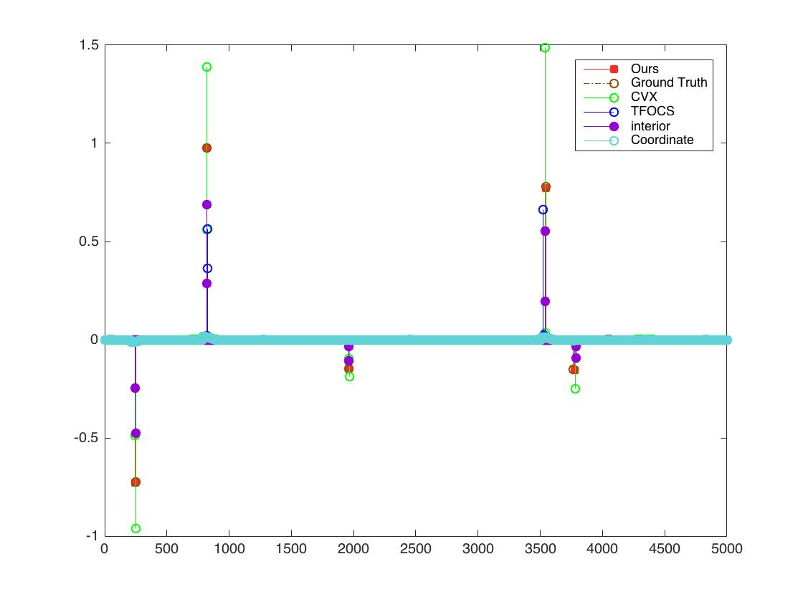
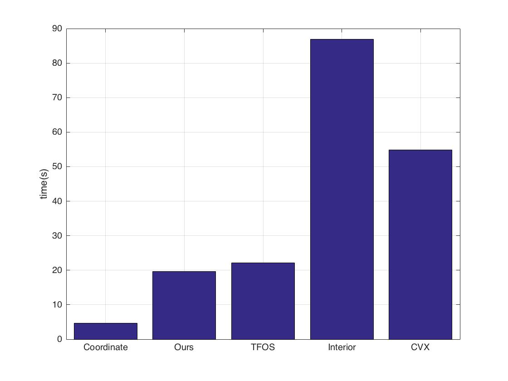
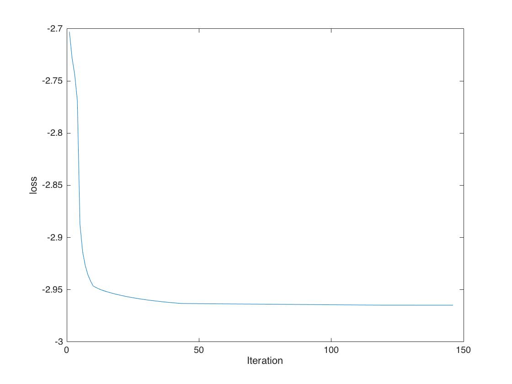

As we can see, our method is much more faster than Interior Point Method and CVX and more accurate(both on positions of support and magnitudes) than all other methods. 

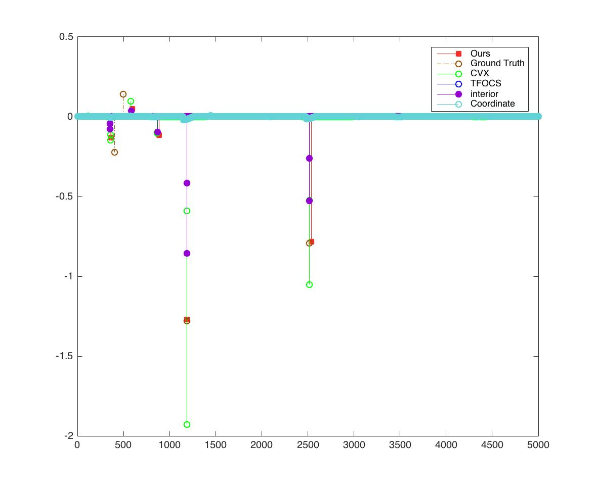
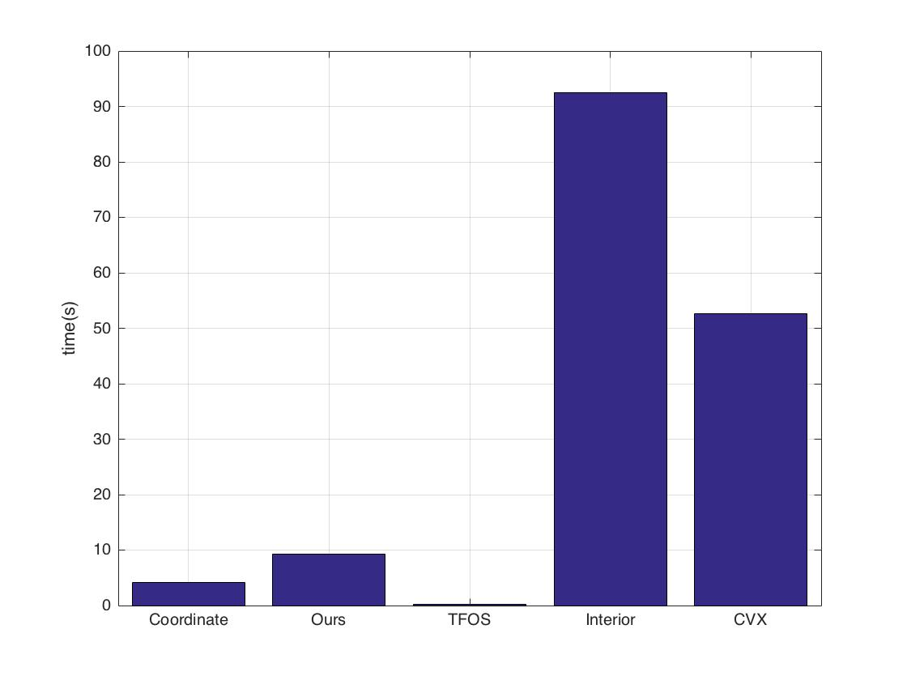
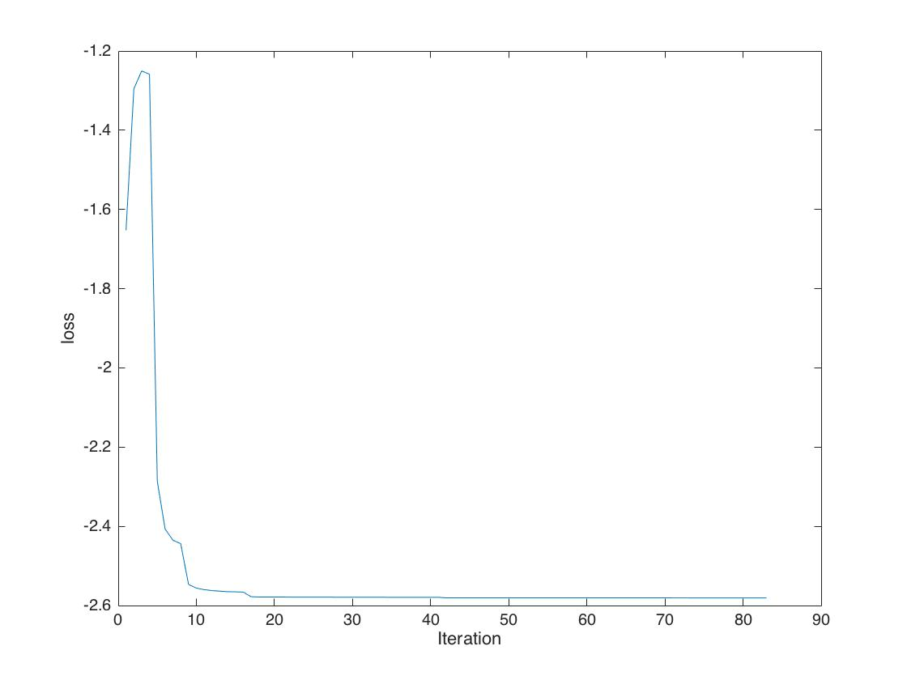

It seems like TFOS fails to meet the tolerance hence result in no solution for the problem. 

### Experiment 2 Results
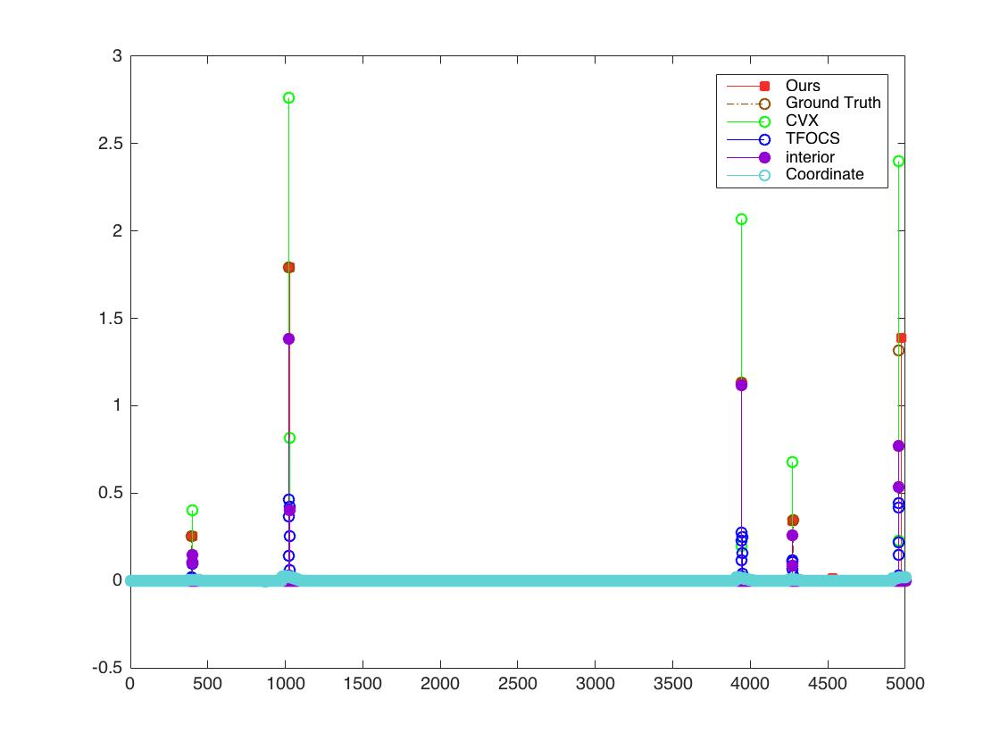
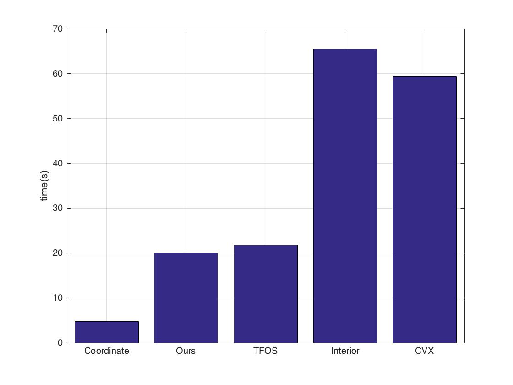
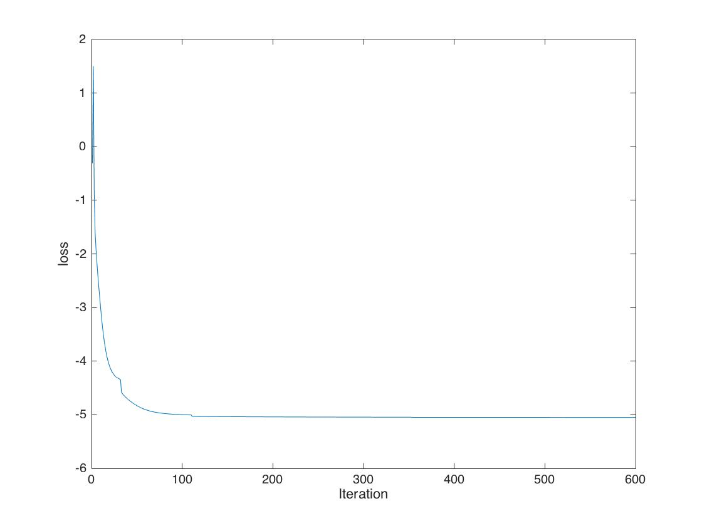

As we can see, our method is much more faster than Interior Point Method and CVX and more accurate(both on positions of support and magnitudes) than all other methods. 
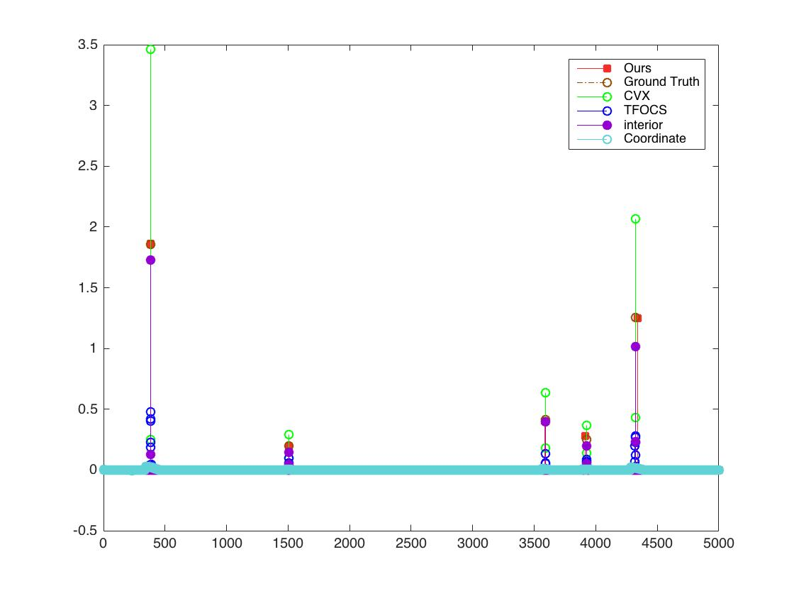
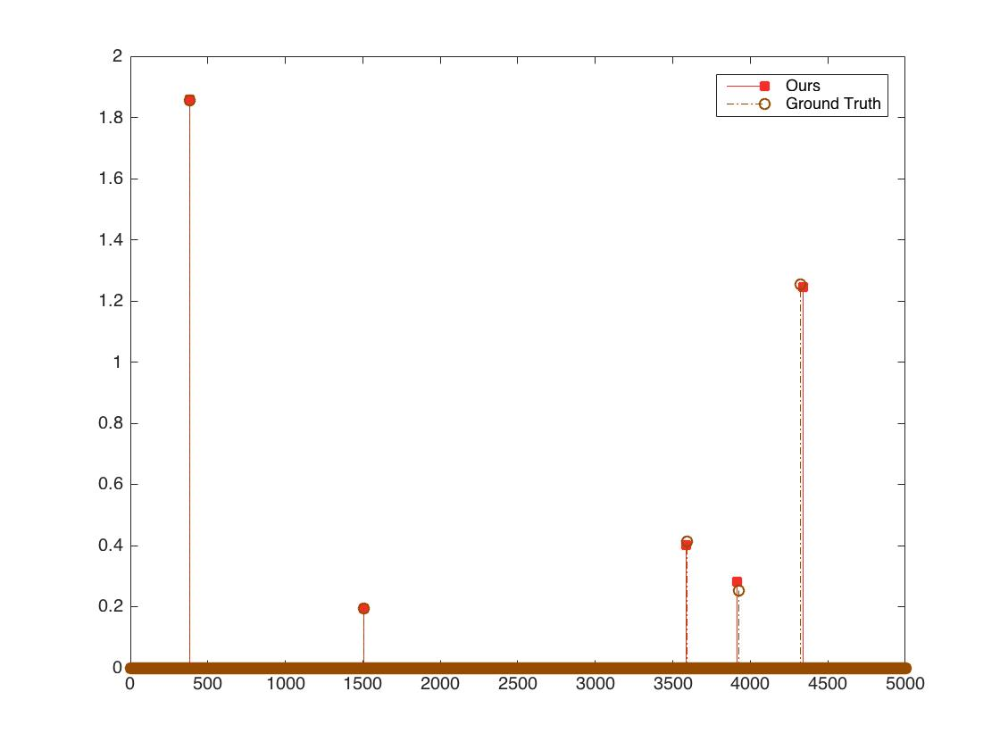
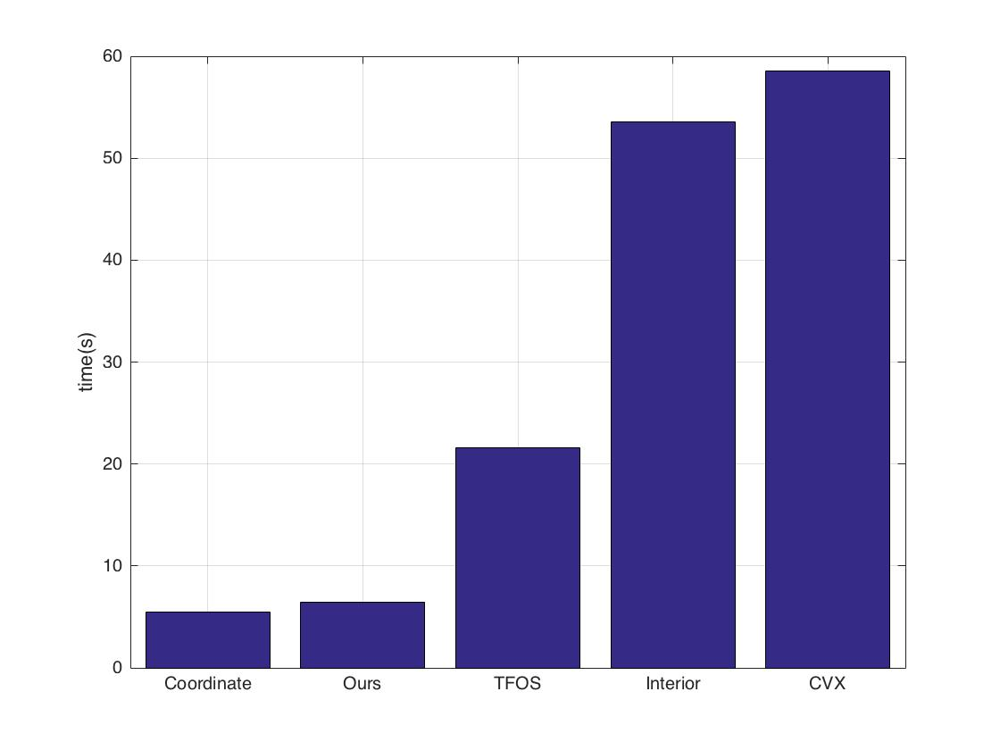
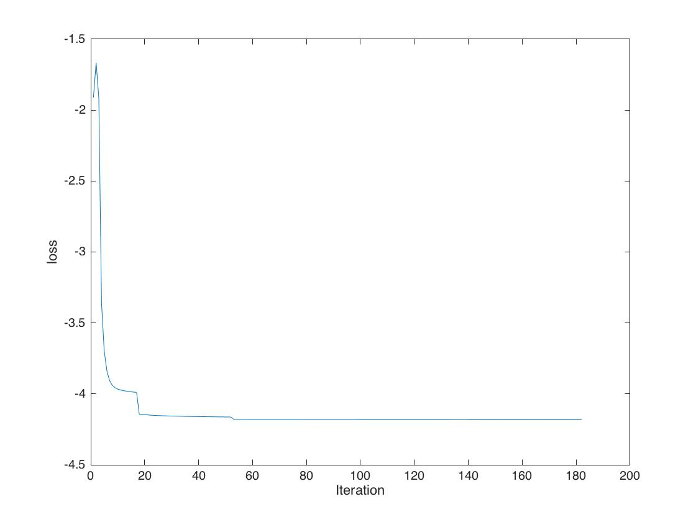

This is another run, same conclusion, and for a clearer graph, I plotted only ground truth and the solution of our method.

## Experiments on MRF Data
Parameter Setting:

|          Parameter          |     Experiment 3     |     Experiment 4   |
|:---------------------------:|:--------------------:|:------------------:|
|           Data Set          |          MRF         |   Conv Generated   |    
|        Data Set Size        |          5000        |       5000         |
|    Nonegative Constraint    |         **Yes**      |      **YES**       |
|        Initialization       |           0          |         0          |
|      Line Search gamma      |          0.1         |        0.1         |
|          Tolerance          |         1e-8         |        1e-8        |
|        Max Iteration        |         5000         |        5000        |
| Line Search First Step Size |           1          |          1         |
|       Projection Mode       | Euclidean Projection |Euclidean Projection|
|  Recover Signal Windowsize  |           50         |          50        | 
|         Error Near 1        |         0.99         |         0.99       |

## Things Found:

* Our method can be speed up by finding an appropriate initialization (\\(x_0\\) and initial stepsize). 
* Interior-point method is much more faster on MRF Data.
* Recovering signal becomes tougher on MRF Data
* CVX Solve dual slower than solve primal 
* To exclude the influence of recovering signal, I also used CVX to solve the dual and set the same recovering parameter to compare our method and CVX. 
